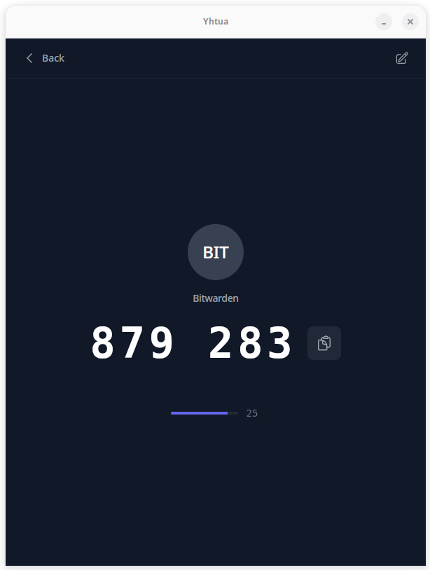

<p align="center">
  
</p>

<h1 align="center">Yhtua</h1>

<p align="center">
  <strong>A secure, open-source 2FA token manager for desktop</strong>
</p>

<p align="center">
  <a href="#features">Features</a> •
  <a href="#security">Security</a> •
  <a href="#installation">Installation</a> •
  <a href="#development">Development</a> •
  <a href="#license">License</a>
</p>

<p align="center">
  
  
  
</p>

---

## Screenshots

<p align="center">
  
  
  
</p>

## Features

### Core Features

- **TOTP Support** — Generate 6, 7, or 8-digit time-based one-time passwords
- **Quick Copy** — Tap to view and auto-copy codes to clipboard
- **Search** — Quickly find tokens by name
- **Import/Export** — Backup and restore your tokens

### Security

- **Encrypted Storage** — Secrets encrypted at rest with AES-256-GCM
- **OS Keychain Integration** — Encryption keys stored in system keychain
- **Password-Protected Backups** — Export files encrypted with PBKDF2 + AES-256-GCM

### Cloud Sync

- **File-Based Sync** — Sync encrypted backups to any cloud folder (Dropbox, Google Drive, OneDrive, etc.)
- **Auto-Sync** — Automatically backup when tokens change
- **Multi-Device** — Share tokens across devices securely
- **Password Mismatch Recovery** — Graceful handling when sync password changes

### User Experience

- **Modern Dark UI** — Clean, consistent dark theme
- **Native Desktop App** — Built with Tauri for a lightweight, fast experience
- **Cross-Platform** — Works on Linux, macOS, and Windows

## Security

Yhtua takes security seriously:

```text
┌─────────────────────────────────────────────────────────────────┐
│                        Local Storage                            │
│  ┌─────────────┐    ┌─────────────┐    ┌─────────────────────┐  │
│  │   Tokens    │───▶│  AES-256-   │───▶│  Encrypted in       │  │
│  │  (secrets)  │    │  GCM        │    │  localStorage       │  │
│  └─────────────┘    └──────┬──────┘    └─────────────────────┘  │
│                            │                                    │
│                    ┌───────▼───────┐                            │
│                    │  Encryption   │                            │
│                    │  Key in OS    │                            │
│                    │  Keychain     │                            │
│                    └───────────────┘                            │
└─────────────────────────────────────────────────────────────────┘

┌─────────────────────────────────────────────────────────────────┐
│                      Export / Sync                              │
│  ┌─────────────┐    ┌─────────────┐    ┌─────────────────────┐  │
│  │   Backup    │───▶│  PBKDF2 +   │───▶│  Encrypted JSON     │  │
│  │   Data      │    │  AES-256-   │    │  file in cloud      │  │
│  │             │    │  GCM        │    │  folder             │  │
│  └─────────────┘    └──────┬──────┘    └─────────────────────┘  │
│                            │                                    │
│                    ┌───────▼───────┐                            │
│                    │  User         │                            │
│                    │  Password     │                            │
│                    └───────────────┘                            │
└─────────────────────────────────────────────────────────────────┘
```

- **Local secrets**: Encrypted with a key stored in your OS keychain (macOS Keychain, Windows Credential Manager, or Linux Secret Service/file fallback)
- **Backup files**: Encrypted with your password using PBKDF2 (600,000 iterations) + AES-256-GCM
- **No network**: Yhtua never sends your data anywhere — sync works via local files

## Installation

### Download

Download the latest release for your platform from the [Releases](https://github.com/iiAku/Yhtua/releases) page.

| Platform | Download                    |
| -------- | --------------------------- |
| Linux    | `.deb`, `.AppImage`, `.rpm` |
| macOS    | `.dmg`                      |
| Windows  | `.msi`, `.exe`              |

### Build from Source

```bash
# Clone the repository
git clone https://github.com/iiAku/Yhtua.git
cd Yhtua

# Install dependencies
bun install

# Run in development mode
bun run tauri dev

# Build for production
bun run tauri build
```

## Development

### Prerequisites

- [Bun](https://bun.sh/) (recommended) or Node.js 18+
- [Rust](https://rustup.rs/) 1.77+
- [Tauri CLI](https://tauri.app/v1/guides/getting-started/prerequisites)

### Tech Stack

- **Frontend**: Nuxt 4, Vue 3, Tailwind CSS
- **Backend**: Tauri 2, Rust
- **Encryption**: ring (AES-256-GCM, PBKDF2)
- **Keychain**: keyring-rs

### Project Structure

```text
Yhtua/
├── app/                    # Nuxt frontend
│   ├── components/         # Vue components
│   ├── composables/        # Vue composables (crypto, store, sync)
│   └── pages/              # App pages
├── src-tauri/              # Tauri backend
│   └── src/
│       ├── crypto.rs       # Encryption & keychain
│       └── lib.rs          # Tauri commands
└── package.json
```

### Commands

```bash
# Development
bun run tauri dev

# Build
bun run tauri build

# Run tests
cargo test --manifest-path src-tauri/Cargo.toml
```

## Contributing

Contributions are welcome! Please feel free to submit a Pull Request.

1. Fork the repository
2. Create your feature branch (`git checkout -b feature/amazing-feature`)
3. Commit your changes (`git commit -m 'Add amazing feature'`)
4. Push to the branch (`git push origin feature/amazing-feature`)
5. Open a Pull Request

## License

This project is licensed under the MIT License - see the [LICENSE](LICENSE) file for details.

## Acknowledgments

- [Tauri](https://tauri.app/) — For the amazing desktop framework
- [Heroicons](https://heroicons.com/) — For the beautiful icons
- [Tailwind CSS](https://tailwindcss.com/) — For the utility-first CSS framework

---

<p align="center">
  Made with ❤️ by <a href="https://github.com/iiAku">iiAku</a>
</p>
